# Ορειβατικό Ημερολόγιο (Mount Athens)

A minimalist, design-first, local-only calendar aggregating upcoming mountaineering events and excursions from major Athenian alpine clubs. 

Built for sheer speed, typographic legibility, and zero unnecessary operational overhead.

---

## ⛰️ Supported Clubs & Crawlers
The application currently crawls, parses, and aggregates calendar events from:
* **ΑΟΣ** (Αθηναϊκός Ορειβατικός Σύλλογος)
* **ΕΟΣ Αθηνών**
* **ΕΟΣ Αχαρνών**
* **ΕΟΣ Ηλιούπολης**
* **ΕΠΟΣ Φυλής**
* **ΠΟΑ** (Πεζοπορικός Όμιλος Αθηνών)
* **ΦΟΝΙ** (Φυσιολατρικός Όμιλος Νέας Ιωνίας)

---

## ⚙️ How It Works (The Data Pipeline)

The project relies entirely on a lightweight, static pipeline that does not require databases or external servers:

```mermaid
graph LR
    A[LINKS.md] --> B[scripts/fetch-raw.js]
    B -->|Raw HTML| C[_input/ folder]
    C --> D[scripts/extract-text.js]
    D -->|Plain Text| E[_input/*.txt]
    E --> F[scripts/parse-events.js]
    F -->|Regex Heuristics| G[src/data/events.json]
    G --> H[Astro static build]
    H --> I[dist/index.html]
```



1. **Crawler (`scripts/fetch-raw.js`):** Reads the URLs from `LINKS.md` and fetches the raw HTML pages of each club, caching them in the local `_input/` folder.
2. **Text Extractor (`scripts/extract-text.js`):** Strips layout noise, scripts, and styling to create clean, plain-text files.
3. **Parser (`scripts/parse-events.js`):** Uses custom-tailored regex patterns to scan the plain-text documents, normalizes Greek characters and accents (so searches are accent-insensitive), filters out past events, and aggregates everything into `src/data/events.json`.
4. **Static Generator:** Astro builds the front-end directly from the JSON database into static HTML.

---

## 🛠️ The Tech Stack

### Frontend
* **Framework:** [Astro v4](https://astro.build/) (Static Site Generation / `output: "static"`)
* **Styling:** [Tailwind CSS](https://tailwindcss.com/)
* **Typography:** `IBM Plex Sans` (for readable, high-legibility UI) and `IBM Plex Mono` (for structured alignment, dates, and badges) via Google Fonts.

### Backend / Utilities
* **Runtime:** Node.js (tested on `v20.20.0`)
* **Scraping Helper:** [Cheerio](https://cheerio.js.org/) (for fast HTML traversal)

---

## 🚀 Getting Started

### Prerequisites
Make sure you have Node.js (`v20+`) and npm installed.

### Setup
1. Clone the repository:
   ```bash
   git clone git@github.com:kostis-kounadis/Mount-Athens.git
   cd Mount-Athens
   ```
2. Install dependencies:
   ```bash
   npm install
   ```

### Running Locally
To start the local development server:
```bash
npm run dev
```
Open [http://localhost:4321/](http://localhost:4321/) in your browser.

### Updating the Events Database
To crawl and parse fresh data from the club websites:
```bash
# 1. Fetch raw HTML
npm run fetch-raw

# 2. Extract and parse events into src/data/events.json
node scripts/parse-events.js
```

### Building for Production
To compile the static pages:
```bash
npm run build
```
The output will be generated in the `dist/` directory.

---

## 🎨 Creative & Architectural Disclaimer

This project is conceived and designed by a graphic designer with a strong intuition for typography, grid structures, and minimal aesthetics. The code, scripts, and static pipelines were constructed through active collaborative pair-programming with agentic AI coding assistants. 

It stands as a testament to the idea that clean, production-grade applications can be built rapidly when design vision and AI reasoning intersect.

---

## 📄 License
This project is open-source and licensed under the permissive [MIT License](LICENSE).
