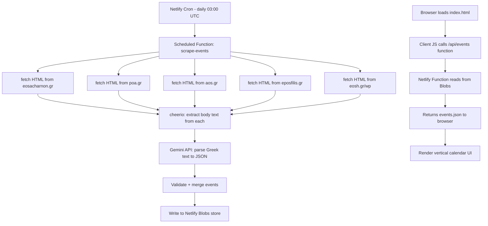

# Project Mount Athens -- Architecture & Implementation Plan

## 1. Overview

A single-page event aggregator for Athens mountaineering clubs, hosted on Netlify Free Tier. A scheduled serverless function scrapes five club websites daily, sends the raw Greek HTML to Google Gemini for structured extraction, and stores the result as JSON. The frontend is plain HTML + Tailwind CDN with zero build step.

## 2. Key Decisions

| Decision | Choice | Rationale |
|---|---|---|
| Repository | New private repo `Mount-Athens` under `kostis-kounadis` | Clean slate, dedicated project |
| Hosting | Netlify Free Tier | Zero cost, built-in scheduled functions |
| Data store | Netlify Blobs | Free, persistent KV store built into Netlify -- no external DB needed |
| AI parsing | Google Gemini API via `@google/genai` SDK | Free tier available, handles Greek text well |
| Frontend | Plain HTML + Tailwind CDN | No build step, designer-friendly |
| Scraping | `cheerio` + native `fetch` | Lightweight, no headless browser needed |

## 3. Architecture



### Data Flow Detail

1. **Scheduled Function** runs at 03:00 UTC daily
2. Fetches raw HTML from each club URL in parallel
3. `cheerio` extracts the relevant content area from each page body
4. Extracted text is sent to Gemini API with a strict system prompt
5. Gemini returns a JSON array of events
6. Function validates the JSON schema, deduplicates, and writes to **Netlify Blobs**
7. A separate lightweight **API function** at `/.netlify/functions/events` reads from Blobs and returns JSON
8. The static `index.html` fetches this endpoint on load and renders the calendar

### Why Netlify Blobs instead of committing events.json?

Netlify Functions run in ephemeral Lambda containers -- they cannot write persistent files to the deploy. The two realistic options are:

- **Option A: Commit to GitHub repo** -- function pushes `events.json` via GitHub API, triggering a redeploy. Requires a GitHub PAT as another secret.
- **Option B: Netlify Blobs** -- built-in persistent store, no extra secrets, reads/writes directly from functions. Data served via a thin API function.

**Recommendation: Option B** -- simpler, fewer moving parts, stays entirely within Netlify.

## 4. Project File Structure

```
Mount-Athens/
  netlify.toml                    # Netlify config: functions dir, redirects, cron schedule
  package.json                    # Dependencies
  
  netlify/
    functions/
      scrape-events.mts           # Scheduled function -- scraper + Gemini integration
      events.mts                  # API function -- serves events from Blobs
  
  public/                         # Static site root, deployed by Netlify
    index.html                    # Main page
    css/
      custom.css                  # Designer overrides on top of Tailwind CDN
    js/
      calendar.js                 # Client-side: fetch events, render calendar grid
    assets/                       # Logos, icons -- provided by designer later
  
  src/
    lib/
      scraper.mjs                 # URL configs, fetch + cheerio extraction logic
      gemini.mjs                  # Gemini API integration + prompt
      schema.mjs                  # Event JSON schema + validation
    config/
      clubs.json                  # Club metadata: name, URL, CSS selectors
  
  plans/                          # This plan file
```

## 5. Event JSON Schema

```json
[
  {
    "id": "eos-acharnon-2026-04-05-parnitha",
    "date": "2026-04-05",
    "club_id": "eos-acharnon",
    "club_name": "EOS Acharnon",
    "event_title": "Parnitha - Bafi Refuge",
    "event_type": "hiking",
    "difficulty": "BD",
    "difficulty_label": "Easy",
    "duration_hours": 5,
    "elevation_gain_m": 600,
    "meeting_point": null,
    "meeting_time": null,
    "description": "Spring hike to Bafi refuge via Tatoi entrance",
    "original_url": "https://eosacharnon.gr/events/parnitha-bafi",
    "scraped_at": "2026-04-01T03:00:00Z"
  }
]
```

**Greek difficulty abbreviations the Gemini prompt must handle:**
- ΒΔ = Easy hiking
- ΥΔ = Moderate hiking  
- ΩΠ = Mountaineering
- ΑΝ = Climbing
- ΟΠ = Trekking

## 6. Gemini System Prompt Strategy

The prompt sent to Gemini will:

1. Declare the role: "You are a data extraction assistant for Greek mountaineering event schedules"
2. Provide the exact JSON schema as the required output format
3. List known Greek abbreviations with mappings
4. Include instructions to handle missing fields gracefully with `null`
5. Specify that dates must be ISO 8601 format
6. Include a few-shot example with real Greek text mapped to expected JSON
7. Instruct: "Return ONLY the JSON array, no markdown fences, no explanation"

Error handling: if Gemini returns invalid JSON or fails, the function logs the error and keeps the previous Blobs data intact.

## 7. netlify.toml Configuration

```toml
[build]
  publish = "public"
  functions = "netlify/functions"

[functions]
  node_bundler = "esbuild"

# API endpoint for events
[[redirects]]
  from = "/api/events"
  to = "/.netlify/functions/events"
  status = 200
```

The scheduled function is configured via its export, not in `netlify.toml`:

```typescript
// scrape-events.mts
export const config = {
  schedule: "0 3 * * *"  // Daily at 03:00 UTC
};
```

## 8. Implementation Phases

### Phase 1: Scaffolding and Environment

- [ ] Create private repo `Mount-Athens` on GitHub via `gh repo create`
- [ ] Initialize `package.json` with dependencies: `@google/genai`, `cheerio`, `@netlify/blobs`
- [ ] Create `netlify.toml` with publish dir, functions dir, and redirect
- [ ] Create `clubs.json` config with the 5 target URLs and club metadata
- [ ] Create the event JSON schema definition in `src/lib/schema.mjs`
- [ ] Create a dummy `events.json` in `public/` for local frontend development
- [ ] Set up `.gitignore` and basic `README.md`

### Phase 2: Scraper and Gemini Integration

- [ ] Implement `src/lib/scraper.mjs` -- fetch HTML from each club URL, extract content with cheerio
- [ ] Investigate each club website to identify the right CSS selectors or content areas for event data
- [ ] Implement `src/lib/gemini.mjs` -- Gemini API call with structured system prompt
- [ ] Write and test the Gemini prompt iteratively against real scraped Greek text
- [ ] Implement `netlify/functions/scrape-events.mts` -- orchestrator that calls scraper, calls Gemini, validates output, writes to Netlify Blobs
- [ ] Implement `netlify/functions/events.mts` -- API function that reads from Blobs and returns JSON
- [ ] Add error handling: retry logic for fetch failures, fallback for Gemini failures
- [ ] Set `GEMINI_API_KEY` as Netlify environment variable

### Phase 3: Frontend

- [ ] Build `public/index.html` skeleton with Tailwind CDN, semantic structure, and responsive meta tags
- [ ] Implement `public/js/calendar.js` -- fetch `/api/events`, group by date, render vertical calendar rows
- [ ] Handle empty states: greyed-out rows for days with no events
- [ ] Add club logos/colors per `club_id` for visual distinction
- [ ] Request final design direction from Product Owner: colors, typography, spacing, logo assets
- [ ] Apply designer CSS overrides in `public/css/custom.css`

### Phase 4: Deployment and Testing

- [ ] Connect `Mount-Athens` repo to Netlify via GitHub integration
- [ ] Configure environment variable `GEMINI_API_KEY` in Netlify dashboard
- [ ] Trigger a manual function invocation to test the full scrape-parse-store pipeline
- [ ] Verify the `/api/events` endpoint returns correct data
- [ ] Verify the frontend renders correctly from live data
- [ ] Monitor scheduled function logs for the first few daily runs

## 9. Risks and Mitigations

| Risk | Impact | Mitigation |
|---|---|---|
| Club websites change structure | Scraper breaks for that club | Per-club CSS selector config in `clubs.json`; Gemini is somewhat resilient to format changes since it parses semantically |
| Gemini returns malformed JSON | No events shown | JSON validation before writing to Blobs; keep previous data if new parse fails |
| Club website blocks requests | No data for that club | Use proper User-Agent header; consider caching last successful scrape |
| Gemini free tier rate limits | Function fails intermittently | Process clubs sequentially with delays; cache results per-club in Blobs |
| Greek encoding issues | Garbled text | Ensure fetch uses UTF-8; cheerio handles encoding well by default |
| Netlify Blobs storage limits | Data loss | Event data is small -- well within free tier limits |

## 10. Environment Variables

| Variable | Where Set | Purpose |
|---|---|---|
| `GEMINI_API_KEY` | Netlify Dashboard | Google AI Studio API key for Gemini calls |

No other secrets required with the Netlify Blobs approach.

## 11. Future Enhancements -- Out of Scope for v1

- Push notifications for new events
- Filtering by club, difficulty, or date range
- Map view with trailheads
- User favorites or calendar export with .ics
- Additional clubs beyond the initial 5
